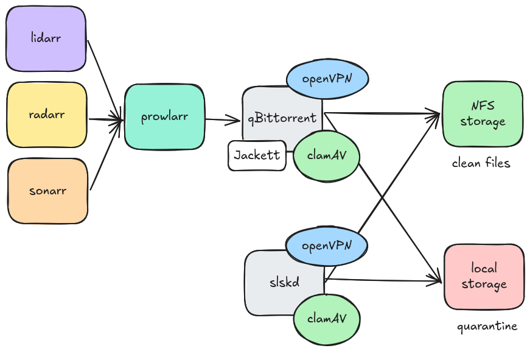

# P2P deployment

This repository defines a set of k8s resources to deploy the following services:
- [lidarr](https://github.com/linuxserver/docker-lidarr)
- [prowlarr](https://github.com/linuxserver/docker-prowlarr)
- [qbittorrent](https://github.com/msd117c/qbittorrent-docker)
- [radarr](https://github.com/linuxserver/docker-radarr)
- [slskd](https://github.com/home-kops/slskd-docker)
- [sonarr](https://github.com/linuxserver/docker-sonarr)

### Configurations

#### lidarr, radarr, sonarr

- Configure access to `prowalarr` for the indexers.
- Configure access to `qBittorrent` to download.
- Configure access to the nfs depending on the media: `/volumeX/data/media/{media_type}` and add the folder as root.

#### prowlarr

- Configure access to `qBittorrent` to download.

#### qBittorrent, slskd

- Enable openvpn and ensure the ip is not leaked (https://ipleak.net/json/).
- Disable port forwading (UPnP)
- Enforce encrypted connections
